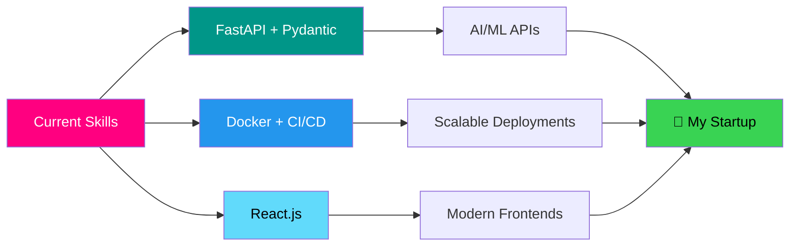

<div align="center">


<br/>


<br/><br/>

<a href="mailto:muhammadhassaanulmustafa@gmail.com">
  
</a>
<a href="https://www.linkedin.com/in/muhammad-hassaan-25480a322/">
  
</a>
<a href="https://github.com/Hassaan146">
  
</a>
<a href="https://github.com/Hassaan146">
  
</a>

<br/>


</div>

<br/>

---


### 👨‍💻 About Me

```python
class Hassaan:
    def __init__(self):
        self.name        = "Muhammad Hassaanulmustafa"
        self.role        = ["AI Engineer", "DevOps", "Backend Dev"]
        self.education   = "B.S. Computer Science @ FAST-NUCES"
        self.location    = "Pakistan 🇵🇰"
        self.experience  = "2+ years (C++, Python, Django)"
        self.stack       = ["FastAPI", "Pydantic", "Docker", "React"]
        self.mission     = "Build Pakistan's next-gen edtech"

    def current_focus(self):
        return [
            "⚡ FastAPI + Pydantic for AI/ML APIs",
            "🐳 Docker, CI/CD, scalable DevOps",
            "⚛️ React component architecture",
            "🚀 Launching my own startup",
        ]

    def philosophy(self):
        return "Scalable. Organized. Maintainable. Always."
```

<br/>

- 🔭 &nbsp; Building **FAST-HUB** — a community-driven platform for FAST-NUCES students
- 🧠 &nbsp; Deep into **AI/ML backend pipelines** with FastAPI & Pydantic
- 🎮 &nbsp; Shipped **C++ SFML games** + enterprise management systems
- 🌐 &nbsp; Cloned **Netflix & Instagram** UIs for fun and learning
- 🇵🇰 &nbsp; Based in **Pakistan** · Open to remote internships & startup collabs
- ⚡ &nbsp; Fun fact: I genuinely think **Python is future-proof**

<br clear="right"/>

---

## 🛠️ Tech Arsenal

<div align="center">

### 💻 Languages

<a href="https://skillicons.dev">
  
</a>

### ⚙️ Frameworks & Backend

<a href="https://skillicons.dev">
  
</a>

<p align="center">
  
  
  
  
</p>

### 🗄️ Databases

<a href="https://skillicons.dev">
  
</a>

### 🐳 DevOps & Cloud

<a href="https://skillicons.dev">
  
</a>

<p align="center">
  
  
  
</p>

### 🧰 Tools & Workflow

<a href="https://skillicons.dev">
  
</a>

</div>

---

## 🎯 What I'm Building

<table>
<tr>
<td width="50%" valign="top">

### ⚡ FAST-HUB
**Community platform for FAST-NUCES students**

- 🎓 Student-focused resource sharing
- 💬 Discussion forums & study groups
- 📚 Course material aggregation
- 🚀 Built with React + FastAPI

</td>
<td width="50%" valign="top">

### 🎮 C++ SFML Projects
**Enterprise systems & GUI games**

- 🏢 Management systems (OOP-driven)
- 🕹️ Interactive SFML games
- 📊 Data structures from scratch
- ⚙️ Built across 2 years at FAST-NUCES

</td>
</tr>
<tr>
<td width="50%" valign="top">

### 🤖 AI/ML Backend Pipelines
**FastAPI + Pydantic services**

- ⚡ Async API endpoints
- ✅ Type-safe validation
- 🔌 ML model serving
- 🐳 Docker-containerized

</td>
<td width="50%" valign="top">

### 🌐 Frontend Clones
**Pixel-perfect UI replicas**

- 🎬 Netflix clone (HTML/CSS/JS)
- 📸 Instagram clone (React)
- 🎨 Component-based design
- 📱 Responsive layouts

</td>
</tr>
</table>

---

## 📊 GitHub Analytics

<div align="center">


&nbsp;


<br/><br/>


<br/>


&nbsp;

&nbsp;


<br/><br/>


</div>

---

## 🏆 Achievements

<div align="center">


</div>

---

## 🐍 Contribution Snake

<div align="center">

<picture>
  <source media="(prefers-color-scheme: dark)" srcset="https://raw.githubusercontent.com/Hassaan146/Hassaan146/output/github-contribution-grid-snake-dark.svg"/>
  <source media="(prefers-color-scheme: light)" srcset="https://raw.githubusercontent.com/Hassaan146/Hassaan146/output/github-contribution-grid-snake.svg"/>
  
</picture>

</div>

---

## 📈 Contribution Activity

<div align="center">


</div>

---

## 🎮 Beyond The Code

<div align="center">

<table>
<tr>
<td align="center" width="33%">
  <br/>
  <b>🎮 Competitive Gamer</b><br/>
  <sub>E-sports enthusiast</sub>
</td>
<td align="center" width="33%">
  <br/>
  <b>📚 System Design Nerd</b><br/>
  <sub>Always reading about scale</sub>
</td>
<td align="center" width="33%">
  <br/>
  <b>💻 HP EliteBook 745 G6</b><br/>
  <sub>My daily driver</sub>
</td>
</tr>
</table>

</div>

---

## 🌱 Currently Leveling Up



---

## 💬 Let's Build Something Together

<div align="center">

I'm **actively looking for**:

🎯 **Internships** &nbsp;·&nbsp; 💼 **Junior Backend / DevOps roles** &nbsp;·&nbsp; 🚀 **Startup Collaborations** &nbsp;·&nbsp; 🎓 **Edtech Partnerships**

<br/>

<a href="mailto:muhammadhassaanulmustafa@gmail.com">
  
</a>
<a href="https://www.linkedin.com/in/muhammad-hassaan-25480a322/">
  
</a>

</div>

---

<div align="center">


<br/><br/>

### ⭐ If you like what you see, drop a star on my repos!

<br/>


</div>
