<!-- Muhammad Hassaan-ul-Mustafa. Profile README.
     Art is generated. Edit the spec in assets/build.py and rerun it:
         python assets/build.py
     Never hand-edit an SVG in assets/, the next build overwrites it.
     One placeholder remains: the portfolio link in section 04. -->

<picture>
  <source media="(prefers-color-scheme: dark)" srcset="assets/hero-dark.svg" />
  <source media="(prefers-color-scheme: light)" srcset="assets/hero-light.svg" />
  
</picture>

## 00 · Identity

Computer Science at FAST-NUCES, currently at Arbisoft. I build AI agents and the backends they run on.

Most AI side projects stop at a notebook. Mine go out with the unglamorous parts attached, because that is what a client ends up depending on. The work I want is the seat where you sit with the person who has the problem, find what it actually is, then build the thing that fixes it.

<picture>
  <source media="(prefers-color-scheme: dark)" srcset="assets/principles-dark.svg" />
  <source media="(prefers-color-scheme: light)" srcset="assets/principles-light.svg" />
  
</picture>

## 01 · Systems

Five things I built, each with the pipeline it actually runs and the numbers that came out of it.

<a id="forge-mentor"></a>

<picture>
  <source media="(prefers-color-scheme: dark)" srcset="assets/sys-forge-dark.svg" />
  <source media="(prefers-color-scheme: light)" srcset="assets/sys-forge-light.svg" />
  
</picture>

An AI agent will happily write two thousand lines on top of a decision nobody made. This one refuses to.

<sub>**[Repository](https://github.com/Hassaan146/forge-mentor)**</sub>

```bash
/plugin marketplace add Hassaan146/forge-marketplace
```

<a id="ai-news-aggregator"></a>

<picture>
  <source media="(prefers-color-scheme: dark)" srcset="assets/sys-news-dark.svg" />
  <source media="(prefers-color-scheme: light)" srcset="assets/sys-news-light.svg" />
  
</picture>

The AI feed is a firehose. This drinks it and hands back five things before breakfast.

<sub>**[Live](https://ai-news-aggregator-weld.vercel.app)** · **[Repository](https://github.com/Hassaan146/ai-news-aggregator)**</sub>

<a id="skyelite-ai"></a>

<picture>
  <source media="(prefers-color-scheme: dark)" srcset="assets/sys-skyelite-dark.svg" />
  <source media="(prefers-color-scheme: light)" srcset="assets/sys-skyelite-light.svg" />
  
</picture>

It rules out where your passport and budget cannot take you, ranks what survives, and shows its working so you can argue with it.

<sub>**[Repository](https://github.com/Hassaan146/ai-travel-planner)**</sub>

<a id="bitmadwall"></a>

<picture>
  <source media="(prefers-color-scheme: dark)" srcset="assets/sys-bitmadwall-dark.svg" />
  <source media="(prefers-color-scheme: light)" srcset="assets/sys-bitmadwall-light.svg" />
  
</picture>

Encrypted messaging and Bitcoin over a mesh of phones, for the places where the network is gone or cannot be trusted.

<sub>**[bitmadwall.ai](https://www.bitmadwall.ai/)**</sub>

<a id="ai-employee-os"></a>

<picture>
  <source media="(prefers-color-scheme: dark)" srcset="assets/sys-employeeos-dark.svg" />
  <source media="(prefers-color-scheme: light)" srcset="assets/sys-employeeos-light.svg" />
  
</picture>

An org where every seat is an agent, and the whole run is replayable afterwards.

<sub>**[Repository](https://github.com/Hassaan146/agentic-ai-workflow)**</sub>

<details>
<summary><sub><b>Everything else, 11 more builds</b></sub></summary>

<br/>

| Project | What it is | Stack |
|---|---|---|
| [AI Fashion Sales Assistant](https://github.com/Hassaan146/ai-fashion-sales-assistant) | Answers Instagram and WhatsApp DMs for clothing brands. 11 intent types, catalog ranking, order state machine, 164 tests | React · Node · MongoDB · LangChain |
| [PayTrace](https://github.com/Hassaan146/PayTrace) | Desktop reconciliation. Matches invoices to bank records in four passes, BCrypt audit trails | Java · JavaFX · SQL Server |
| [Preflight](https://github.com/Hassaan146/preflight) | Audits AI-generated projects against a 31 area production standard, then fixes and verifies | LangGraph · Groq |
| [Agentika](https://github.com/Hassaan146/agentika) | Research agent with a hand written ReAct loop, web search and file analysis | FastAPI · Groq |
| [Forge Marketplace](https://github.com/Hassaan146/forge-marketplace) | Install source for the Forge Mentor plugin | Claude Code |
| [AI Client Finder](https://github.com/Hassaan146/ai-client-finder) | Sources and qualifies leads | Python |
| [B2B SaaS](https://github.com/Hassaan146/B2B-SaaS-) | Team collaboration platform with orgs, tasks and subscriptions | FastAPI · Clerk |
| [CityMind Urban AI](https://github.com/Hassaan146/Citymind_Urban_Ai) | Urban data intelligence prototype | Python |
| [Consumer Price Index](https://github.com/Hassaan146/Consumer-Price-Index) | CPI pipeline built on discrete mathematics | Python |
| [ChronoRift OS](https://github.com/Hassaan146/ChronoRiftOS) | Operating systems coursework | C++ |
| [Super Mario COAL](https://github.com/Hassaan146/Super-Mario-COAL) | A game written in x86 assembly | Assembly |

</details>

## 02 · Toolchain

<picture>
  <source media="(prefers-color-scheme: dark)" srcset="assets/toolchain-dark.svg" />
  <source media="(prefers-color-scheme: light)" srcset="assets/toolchain-light.svg" />
  
</picture>

## 03 · Signals

<picture>
  <source media="(prefers-color-scheme: dark)" srcset="assets/signals-dark.svg" />
  <source media="(prefers-color-scheme: light)" srcset="assets/signals-light.svg" />
  
</picture>

<div align="center">
<picture>
  <source media="(prefers-color-scheme: dark)" srcset="https://raw.githubusercontent.com/Hassaan146/Hassaan146/output/snake-dark.svg" />
  <source media="(prefers-color-scheme: light)" srcset="https://raw.githubusercontent.com/Hassaan146/Hassaan146/output/snake-light.svg" />
  
</picture>
</div>

## 04 · Contact

At Arbisoft right now. Open to contract work and startup collaborations, mostly around AI agents and backend systems.

If you are building something and part of it is stuck, that is the email I like getting.

|  |  |
|---|---|
| **Email** | [muhammadhassaanulmustafa@gmail.com](mailto:muhammadhassaanulmustafa@gmail.com) |
| **LinkedIn** | [muhammad-hassaan](https://linkedin.com/in/muhammad-hassaan25480a322) |
| **Portfolio** | coming soon <!-- drop the URL here when the site is live --> |

<picture>
  <source media="(prefers-color-scheme: dark)" srcset="assets/signoff-dark.svg" />
  <source media="(prefers-color-scheme: light)" srcset="assets/signoff-light.svg" />
  
</picture>

<sub>**Colophon.** Every mark on this page is drawn by [`assets/build.py`](assets/build.py), which reads a spec, measures each label to size its own box so nothing ever clips, and writes animated SVG. The figures in section 03 come from the GitHub API and a [scheduled job](.github/workflows/refresh.yml) redraws them each morning; if the API cannot be reached it keeps the last correct numbers. No image here queries GitHub when you load the page, which is what turns a stat widget into an error box on a bad day. There are no badge services: the toolchain block replaced 42 separate requests to shields.io. Motion switches itself off for anyone whose system asks for less of it.</sub>
