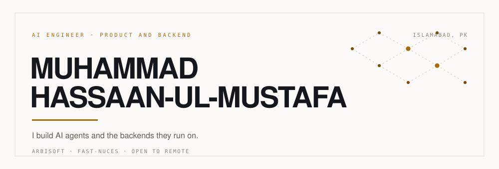
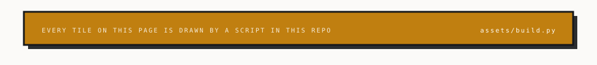

<!-- Muhammad Hassaan-ul-Mustafa. Profile README.
     The hero, the project cards and the signals panel are generated:
         python assets/build.py
     Never hand-edit an SVG in assets/, the next build overwrites it.
     One placeholder remains: the portfolio link in section 04. -->

<picture>
  <source media="(prefers-color-scheme: dark)" srcset="assets/hero-dark.svg" />
  <source media="(prefers-color-scheme: light)" srcset="assets/hero-light.svg" />
  
</picture>

<div align="center">

[](#)
[](https://linkedin.com/in/muhammad-hassaan25480a322)
[](mailto:muhammadhassaanulmustafa@gmail.com)

</div>

---

## 🧭 00 · Identity



I build **AI agents** and the **backends** they run on. Computer Science at FAST-NUCES, currently at **Arbisoft**.

> 💡 **What I care about:** most AI side projects stop at a notebook. Mine go out with the unglamorous parts attached, because that is what a client ends up depending on.

- 🛡️ &nbsp; **Guardrails first** &nbsp;·&nbsp; rate limiting, validation and row level security before features
- 🔌 &nbsp; **Degrade, do not die** &nbsp;·&nbsp; every external call has a fallback, clone it and it runs with zero keys
- 📐 &nbsp; **Decide before coding** &nbsp;·&nbsp; the architectural choice gets made, and written down, first
- 🥉 &nbsp; **3rd Place**, National AI Hackathon &nbsp;·&nbsp; ⭐ production adopter of the Graph Context Framework
- 🌍 &nbsp; Based in Islamabad, Pakistan 🇵🇰 &nbsp;·&nbsp; open to remote

<br clear="right"/>

---

## 🚀 01 · Systems

<a id="forge-mentor"></a>

<picture>
  <source media="(prefers-color-scheme: dark)" srcset="assets/sys-forge-dark.svg" />
  <source media="(prefers-color-scheme: light)" srcset="assets/sys-forge-light.svg" />
  
</picture>

An AI agent will happily write two thousand lines on top of a decision nobody made. **This one refuses to.**

| | |
|---|---|
| 🚦 **Decision gate** | Blocks code from moving past an architectural question you have not answered |
| 📝 **Recorded rationale** | Every call written to `.claude/forge/`, so the reasoning outlives the sprint |
| 🧪 **1,216 tests** | At 100% coverage |
| ⚙️ **Three modes** | `pipeline` · `accept-edits` · `auto` |

```bash
/plugin marketplace add Hassaan146/forge-marketplace
```

[](https://github.com/Hassaan146/forge-mentor)

<br/>

<a id="ai-news-aggregator"></a>

<picture>
  <source media="(prefers-color-scheme: dark)" srcset="assets/sys-news-dark.svg" />
  <source media="(prefers-color-scheme: light)" srcset="assets/sys-news-light.svg" />
  
</picture>

The AI feed is a firehose. **This drinks it and hands back five things before breakfast.**

| | |
|---|---|
| 🕸️ **Coverage** | 164 sites and 36 YouTube channels: labs, product blogs, newsletters, policy |
| 🧠 **Summaries** | Groq writes them, Gemini covers the outages |
| 📬 **Delivery** | A personalised top five, emailed every morning |
| 💳 **Payments** | Stripe subscriptions, user accounts, review system |

[](https://ai-news-aggregator-weld.vercel.app)
[](https://github.com/Hassaan146/ai-news-aggregator)

<br/>

<a id="skyelite-ai"></a>

<picture>
  <source media="(prefers-color-scheme: dark)" srcset="assets/sys-skyelite-dark.svg" />
  <source media="(prefers-color-scheme: light)" srcset="assets/sys-skyelite-light.svg" />
  
</picture>

It rules out where your passport and budget cannot take you, ranks what survives, and **shows its working so you can argue with it.**

| | |
|---|---|
| 🥉 **3rd Place** | National AI Hackathon |
| 🧭 **Seven node graph** | `intake → filter → visa → research → scoring → tradeoff → final` |
| 🛡️ **Security first** | CORS allow-listing, rate limits, prompt-injection sanitising, RLS on Supabase |
| 🔑 **Zero keys to run** | Every external call degrades to a mock, so a fresh clone just works |
| ⭐ **Recognised** | Listed production adopter of the Graph Context Framework |

[](https://github.com/Hassaan146/ai-travel-planner)

<br/>

<a id="bitmadwall"></a>

<picture>
  <source media="(prefers-color-scheme: dark)" srcset="assets/sys-bitmadwall-dark.svg" />
  <source media="(prefers-color-scheme: light)" srcset="assets/sys-bitmadwall-light.svg" />
  
</picture>

Encrypted messaging and Bitcoin across a mesh of phones, **for the places where the network is gone or cannot be trusted.**

| | |
|---|---|
| 📡 **Transport** | Bluetooth LE · Wi-Fi Direct · optional LoRa, reaching 2 to 5 km |
| 🔐 **Crypto** | AES-256-GCM with Signal style double ratchet |
| 🕸️ **Routing** | Self healing mesh, up to seven hops, store and forward when nobody is in range |
| 🪪 **Identity** | Cryptographic. No phone number, no SIM |
| 🧨 **Panic wipe** | On device, for denied environments |

[](https://www.bitmadwall.ai/)

<br/>

<a id="ai-employee-os"></a>

<picture>
  <source media="(prefers-color-scheme: dark)" srcset="assets/sys-employeeos-dark.svg" />
  <source media="(prefers-color-scheme: light)" srcset="assets/sys-employeeos-light.svg" />
  
</picture>

An org where **every seat is an agent**, and the whole run is replayable afterwards.

| | |
|---|---|
| 🗣️ **Input** | One messy request, in plain English |
| 🧩 **Decompose** | Broken into a dependency aware workflow |
| 🤝 **Route** | Each piece handed to the agent that owns it |
| 🔍 **Trace** | Every step timed, logged and replayable |

[](https://github.com/Hassaan146/agentic-ai-workflow)

<details>
<summary><b>📦 Everything else, 11 more builds</b></summary>

<br/>

| Project | What it is | Stack |
|---|---|---|
| [AI Fashion Sales Assistant](https://github.com/Hassaan146/ai-fashion-sales-assistant) | Answers Instagram and WhatsApp DMs for clothing brands. 11 intent types, catalog ranking, order state machine, 164 tests | React · Node · MongoDB · LangChain |
| [PayTrace](https://github.com/Hassaan146/PayTrace) | Desktop reconciliation. Matches invoices to bank records in four passes, BCrypt audit trails | Java · JavaFX · SQL Server |
| [Preflight](https://github.com/Hassaan146/preflight) | Audits AI-generated projects against a 31 area production standard, then fixes and verifies | LangGraph · Groq |
| [Agentika](https://github.com/Hassaan146/agentika) | Research agent with a hand written ReAct loop, web search and file analysis | FastAPI · Groq |
| [Forge Marketplace](https://github.com/Hassaan146/forge-marketplace) | Install source for the Forge Mentor plugin | Claude Code |
| [AI Client Finder](https://github.com/Hassaan146/ai-client-finder) | Sources and qualifies leads | Python |
| [B2B SaaS](https://github.com/Hassaan146/B2B-SaaS-) | Team collaboration platform with orgs, tasks and subscriptions | FastAPI · Clerk |
| [CityMind Urban AI](https://github.com/Hassaan146/Citymind_Urban_Ai) | Urban data intelligence prototype | Python |
| [Consumer Price Index](https://github.com/Hassaan146/Consumer-Price-Index) | CPI pipeline built on discrete mathematics | Python |
| [ChronoRift OS](https://github.com/Hassaan146/ChronoRiftOS) | Operating systems coursework | C++ |
| [Super Mario COAL](https://github.com/Hassaan146/Super-Mario-COAL) | A game written in x86 assembly | Assembly |

</details>

---

## 🛠️ 02 · Toolchain

<div align="center">

**AI and agents**


**Languages**

[](https://skillicons.dev)

**Backend**

[](https://skillicons.dev)

**Frontend**

[](https://skillicons.dev)

**Data**

[](https://skillicons.dev)

**Ship and test**

[](https://skillicons.dev)

</div>

---

## 📊 03 · Signals

<picture>
  <source media="(prefers-color-scheme: dark)" srcset="assets/signals-dark.svg" />
  <source media="(prefers-color-scheme: light)" srcset="assets/signals-light.svg" />
  
</picture>

<div align="center">
<picture>
  <source media="(prefers-color-scheme: dark)" srcset="https://raw.githubusercontent.com/Hassaan146/Hassaan146/output/snake-dark.svg" />
  <source media="(prefers-color-scheme: light)" srcset="https://raw.githubusercontent.com/Hassaan146/Hassaan146/output/snake-light.svg" />
  
</picture>
</div>

---

## 📬 04 · Contact

At **Arbisoft** right now. Open to contract work and startup collaborations, mostly around AI agents and backend systems.

If you are building something and part of it is stuck, that is the email I like getting.

<div align="center">

[](mailto:muhammadhassaanulmustafa@gmail.com)
[](https://linkedin.com/in/muhammad-hassaan25480a322)

<picture>
  <source media="(prefers-color-scheme: dark)" srcset="assets/signoff-dark.svg" />
  <source media="(prefers-color-scheme: light)" srcset="assets/signoff-light.svg" />
  
</picture>

</div>

<sub>**Colophon.** The hero, the project cards and the signals panel are drawn by [`assets/build.py`](assets/build.py), which reads a spec, measures each label to size its own box so nothing clips, and writes animated SVG. The figures in section 03 come from the GitHub API and a [scheduled job](.github/workflows/refresh.yml) redraws them each morning; if the API is unreachable it keeps the last correct numbers. Motion switches itself off for anyone whose system asks for less of it.</sub>
