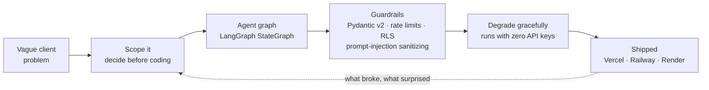

<!-- ═══════════════════════════════════════════════════════════════
     Muhammad Hassaan-ul-Mustafa — GitHub profile README
     Repo: github.com/Hassaan146/Hassaan146
     One TODO left: the portfolio URL below, once the site is live.
     Banner art lives in assets/ — edit banner-dark.svg and banner-light.svg together.
     ═══════════════════════════════════════════════════════════════ -->

<div align="center">

<picture>
  <source media="(prefers-color-scheme: dark)" srcset="assets/banner-dark.svg" />
  <source media="(prefers-color-scheme: light)" srcset="assets/banner-light.svg" />
  
</picture>

<a href="https://github.com/Hassaan146">
  
</a>

<br/>

<!-- TODO: replace the "#" below with your portfolio URL once the site is live -->
[](#)
[](https://linkedin.com/in/muhammad-hassaan25480a322)
[](mailto:muhammadhassaanulmustafa@gmail.com)
[](https://github.com/Hassaan146)

</div>

---

## Who I am

I build AI systems that make decisions under real constraints — and then I put them in front of real users.

Most "AI projects" stop at a notebook. Mine ship with rate limiting, input validation, row-level security, graceful degradation when an API key is missing, and a URL you can open. That gap — between a working prototype and something a client can depend on — is the part I care about.

```yaml
name:      Muhammad Hassaan-ul-Mustafa
role:      AI Forward-Deployed Engineer · Product & Backend
studying:  BS Computer Science, FAST-NUCES  (Aug 2024 → May 2028)
based_in:  Islamabad, Pakistan  ·  open to remote
now_at:    Arbisoft
before:    Tashi — enterprise AI (BitMadWall, tashitech.ai)
building:
  - Forge Mentor — a Claude Code plugin, now at v1.28
  - AI Employee OS — an org where every seat is an agent
strongest_at:
  - LangGraph / multi-agent orchestration & context passing
  - FastAPI + Pydantic v2 backends that survive production
  - Turning a vague client problem into a shipped, scoped system
looking_for:  Forward-deployed engineering · AI product roles
```

### How I build

Same shape every time — the guardrails and the fallbacks are the part most people skip.



### Recognition

| | |
|---|---|
| 🥉 | **3rd Place — National AI Hackathon** for [SkyElite&nbsp;AI](https://github.com/Hassaan146/ai-travel-planner) |
| ⭐ | **Recognized production adopter** of **GCF (Graph Context Framework)** — listed on *Who Uses GCF* for cross-agent context passing |
| 📜 | **Agent Skills with Anthropic** — DeepLearning.AI |
| 📜 | **CS50P: Introduction to Programming with Python** — Harvard University |
| 📜 | **AI for Everyone** — Andrew Ng, DeepLearning.AI |

---

## Featured work

### 📡 BitMadWall — *"Communications that do not depend on the network."*
> **[bitmadwall.ai →](https://www.bitmadwall.ai/)** · shipped at [Tashi](https://www.tashitech.ai/)

Sovereign secure mesh communications. Encrypted messaging and Bitcoin transactions relay **device to device** over Bluetooth LE, Wi-Fi Direct, and optional LoRa — no internet, no cell tower, no server anywhere in the path.

| | |
|---|---|
| **Crypto** | AES-256-GCM · Signal-style double-ratchet key derivation |
| **Transport** | Bluetooth LE · Wi-Fi Direct · optional LoRa (2–5 km range) |
| **Routing** | Self-healing mesh, up to 7 hops, store-and-forward for delayed delivery |
| **Identity** | Cryptographic — no phone number, no SIM |
| **Safety** | Panic wipe |

Built for the moments when the network is gone or can't be trusted: continuity of government, disaster response, field teams in denied environments.

<br/>

### 🏢 Tashi — the enterprise AI platform site
> **[tashitech.ai →](https://www.tashitech.ai/)**

Built and shipped the public platform site for [Tashi](https://www.tashitech.ai/), an enterprise AI company running on one thesis: *the future of operations is human + agents.* Agents that orchestrate across ERP and CRM systems, carry governance and approvals inside every action, and anchor each operation on-chain so the audit trail is provable rather than promised.

The site is the front door for all of it — platform architecture, six industry solution tracks (finance, retail, healthcare, security, enterprise, education), customer stories, and the demo funnel.

<br/>

### 🛰️ SkyElite AI — travel decisions, not travel blogs
> 🥉 3rd Place, National AI Hackathon · ⭐ Recognized GCF production adopter
> **[Source →](https://github.com/Hassaan146/ai-travel-planner)**

Give it your passport, budget, and interests. It rules out the destinations you legally or financially *can't* reach, then ranks what's left — and tells you what it traded away to get there.

```
intake → filter → visa → research → scoring → tradeoff → final
└──────────── 7-node LangGraph StateGraph ────────────┘
```

- Scores every candidate across **safety, budget, visa difficulty, and scenery**, returning ranked packages with confidence levels, source counts, and honest tradeoffs — not a confident-sounding guess.
- Security-first backend: CORS allow-listing, rate limiting, Pydantic v2 validation, prompt-injection sanitization, and **RLS-enforced** Supabase persistence.
- GRASP + GoF patterns throughout (Repository, Abstract Factory, Adapter, Strategy, Facade).
- **Runs with zero API keys** — every external dependency degrades to a mock or in-memory fallback, so a new contributor is productive in one clone.

| Layer | Stack |
|---|---|
| Frontend | Next.js 15 · TypeScript · Tailwind CSS · Three.js |
| Backend | FastAPI · Pydantic v2 · LangGraph |
| AI | Anthropic API (Claude Haiku 4.5) · Tavily |
| Data | Supabase (Postgres + RLS) |
| Deploy | Vercel · Railway |

<br/>

### 📰 Asme — AI news, filtered down to five things worth reading
> **[Live demo →](https://ai-news-aggregator-weld.vercel.app)** · **[Source →](https://github.com/Hassaan146/ai-news-aggregator)**

The AI feed is a firehose. Asme drinks it so you don't: it scrapes **164 sites and 36 YouTube channels** — labs, product blogs, newsletters, policy sources — then hands each user a personalized top-5 digest in their inbox every morning.

- Modular services for scraping, ranking, digesting, email, subscriptions, reviews, and admin — each behind its own FastAPI REST surface.
- LLM agents write the summaries, with **Groq primary and Gemini fallback** so a single provider outage doesn't kill the digest.
- Real product plumbing: user auth, Stripe payments, a deployed React dashboard.

`React` `Vite` `Tailwind` `FastAPI` `SQLAlchemy` `PostgreSQL (Neon)` `Groq` `Gemini` `Stripe` `Render` `Vercel`

<br/>

### 🔨 Forge Mentor — a Claude Code plugin that makes you decide before you code
> **[Source →](https://github.com/Hassaan146/forge-mentor)** · MIT · v1.28.0

AI coding agents happily write 2,000 lines on top of a decision nobody made. Forge Mentor stops that: it teaches the load-bearing architectural choice, lays out the options with a recommendation, **waits for your call**, records it in `.claude/forge/`, and blocks code from moving past an undecided question.

- Decisions become part of the codebase — rationale, not just result — so the *why* survives the sprint.
- Three workflow modes: `pipeline`, `accept-edits`, `auto`.
- **1,216 tests at 100% coverage.** Every step announces what it will write before writing it.

```bash
/plugin marketplace add Hassaan146/forge-marketplace
```
```bash
/plugin install forge@forge-marketplace
```

`Python 3.12+` `MCP` `Claude` `Git`

<br/>

### 🛍️ AI Fashion Sales Assistant — the DM that closes the sale
> **[Source →](https://github.com/Hassaan146/ai-fashion-sales-assistant)**

Clothing brands lose orders in unread Instagram DMs. This assistant answers them: it understands what the customer actually wants, recommends from the live catalog, reads their mood, and walks the order to completion — across Instagram, WhatsApp, and web chat.

A **three-phase pipeline** does the work:

| Phase | What happens |
|---|---|
| **1 · NLU** | Extracts **11 intent types** plus entities — colour, size, price band |
| **2 · Recommend + sentiment** | Ranks catalog matches, adds upsells, classifies customer mood |
| **3 · Converse** | State machine collects the order; templates keep replies on-brand |

Rule-based fast path for common messages, LLM path for everything else — so it still works with **no API key at all**. 164 automated tests.

`React` `Vite` `Tailwind` `Node.js` `Express` `MongoDB` `JWT` `LangChain` `Llama 3.3` `OpenAI API`

<br/>

### 💳 PayTrace — reconciliation for startups without a finance team
> **[Source →](https://github.com/Hassaan146/PayTrace)**

A desktop system that matches vendor invoices against bank records automatically, through a **four-stage engine**: Exact → Vendor Reference → Tolerant → Partial-Payment. Role-aware KPIs, email notifications, undo/redo, and BCrypt-secured audit trails, built on a Maven architecture using Strategy, Factory, Command, Observer, DAO, MVC, and Singleton.

`Java` `JavaFX` `SQL Server` `Maven` `SMTP` `BCrypt`

<br/>

### 🧑‍💼 AI Employee OS — an org chart where every seat is an agent
> **[Source →](https://github.com/Hassaan146/agentic-ai-workflow)**

A company staffed entirely by AI. Give it a messy request in plain English; it decomposes that into a **dependency-aware workflow**, routes each piece to the specialist agent that should own it, validates what comes back, and shows you the full execution trace instead of asking you to trust it.

Each role — sales, research, ops, engineering — is an agent with its own scope, tools, and handoffs, coordinating like a team instead of firing off one-shot prompts. Everything the other projects taught me about orchestration, pointed at one question: how much of a company can actually run itself?

`Next.js` `React` `FastAPI` `Pydantic` `LangGraph` `LangChain` `Supabase` `Groq` `Gemini` `Vercel` `Render`

<br/>

<details>
<summary><b>More builds — click to expand</b></summary>

<br/>

| Project | What it is | Stack |
|---|---|---|
| [Forge Marketplace](https://github.com/Hassaan146/forge-marketplace) | Install source for the Forge Mentor plugin | Claude Code plugin registry |
| [Agentika](https://github.com/Hassaan146/agentika) | Agentic workflow experiments | Python |
| [AI Client Finder](https://github.com/Hassaan146/ai-client-finder) | Agent that sources and qualifies leads | Python · LLM APIs |
| [CityMind Urban AI](https://github.com/Hassaan146/Citymind_Urban_Ai) | Urban data intelligence prototype | Python |
| [Consumer Price Index](https://github.com/Hassaan146/Consumer-Price-Index) | CPI pipeline built on discrete-mathematics foundations | Python |
| [ChronoRift OS](https://github.com/Hassaan146/ChronoRiftOS) | Operating-systems coursework — low-level systems | C++ |
| [City Management System](https://github.com/Hassaan146/City-Management-System-DSA) | Graph & data-structure heavy simulation | C++ |
| [Super Mario COAL](https://github.com/Hassaan146/Super-Mario-COAL) | Game written in x86 assembly | Assembly |
| [Ivor Hospital DB](https://github.com/Hassaan146/IvorHospitalDB) | Hospital database system | PHP · SQL |
| [Weight Prediction](https://github.com/Hassaan146/WeightPrediction_mlr_rf) | Multiple linear regression vs. random forest, written up in full | Statistical modelling · TeX |

</details>

---

## Stack

**Languages**


**AI & agents**


**Backend**


**Frontend**


**Data**


**Ship & test**


---

## Activity

<div align="center">


<br/>


<br/>


<br/><br/>


<br/><br/>

<picture>
  <source media="(prefers-color-scheme: dark)" srcset="https://raw.githubusercontent.com/Hassaan146/Hassaan146/output/snake-dark.svg" />
  <source media="(prefers-color-scheme: light)" srcset="https://raw.githubusercontent.com/Hassaan146/Hassaan146/output/snake-light.svg" />
  
</picture>

</div>

---

## Working with me

Currently at **Arbisoft**, and always interested in **forward-deployed engineering** and **AI product** work — the seat where you sit with the client, find the real problem, and build the thing that fixes it. Contract work and startup collaborations welcome.

Best first message: what you're building and what's stuck.

<div align="center">

[](mailto:muhammadhassaanulmustafa@gmail.com)
[](https://linkedin.com/in/muhammad-hassaan25480a322)

<br/>


</div>
